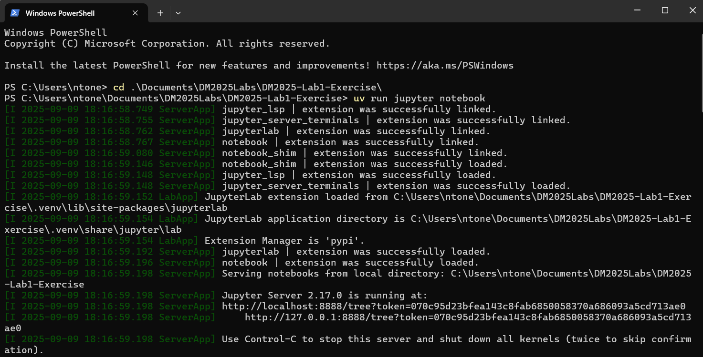
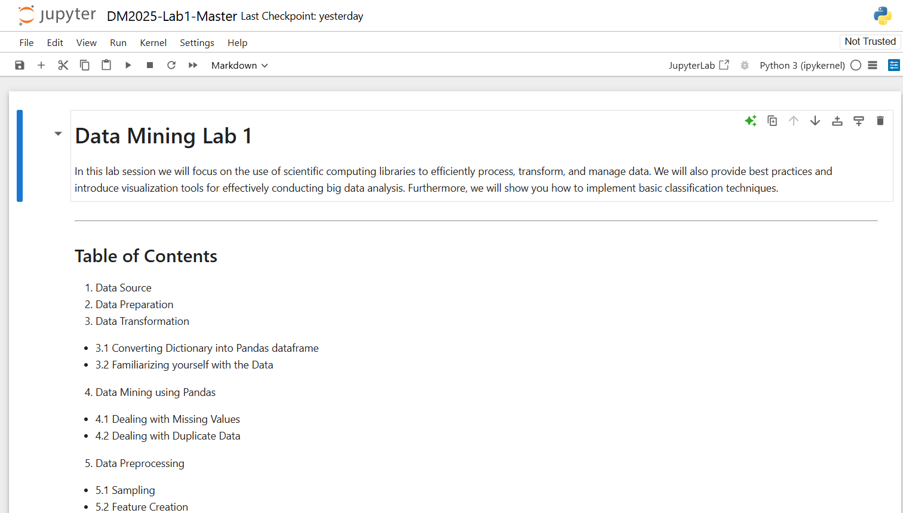

# [DM2025] Lab 1 – Environment Setup

Hi everyone,

We will have our first lab session on **September 15 (Monday)** at **9:00 AM** via our **YouTube Stream / Classroom**. Please be on time.

We strongly recommend setting up the environment on your personal laptop before the lab session so that you can follow along smoothly.

This document provides detailed instructions for setting up the environment required for the course.

---

## System Requirements

Please make sure you have the following installed:

* Python 3.9.9
* uv (Python virtual environment manager)
* Git
* GitHub account
* Jupyter Notebook

---

## Setup Instructions

### 1. Install Python 3.9.9

Download and install Python 3.9.9:
https://www.python.org/downloads/release/python-399/

During installation, check "**Add Python to PATH**".

Verify installation:

```bash
python --version
```
Expected output:
Python 3.9.9  


### 2. Create a GitHub Account and Install Git
#### Sign up for GitHub: https://github.com/  
#### Install Git:  
Windows: https://gitforwindows.org/  
Linux:

```bash
sudo apt install git-all
```
macOS:


```bash
brew install git
```
Verify installation:

```bash
git --version
```
Configure Git (replace with your GitHub username and email):
```bash
git config --global user.name "YOUR_USERNAME"
git config --global user.email "your_email@example.com"
```


### 3. Fork the Repository Under the Project Folder
Go to: https://github.com/leoson-wu/DM2025-Lab1-Exercise  
Sign in your GitHub account  
Click "Fork" to copy it into your own GitHub account.  


### 4. Install uv
In terminal or PowerShell:

```bash
pip install uv
uv --version
```
### 5. Create a Project Folder
Choose a location for your labs and create a directory:

```bash
mkdir DM2025Labs
cd DM2025Labs
```
### 6. Clone Your Forked Repository
```bash
git clone https://github.com/<your-github-username>/DM2025-Lab1-Exercise.git
cd DM2025-Lab1-Exercise
```


### 7. Create a Virtual Environment with uv
```bash
uv venv
```

This creates a .venv folder inside the project.

### 8. Sync Dependencies
```bash
uv sync
```
This installs all required Python packages.

### 9. (Optional) Manually install Libraries
You may need to add libraries manually if the **step 8** cannot install the required libraries successfully:  
```bash
uv add jupyter numpy pandas matplotlib plotly nltk scikit-learn seaborn pami umap-learn
```
You can also install the extra libraries if needed.  

For NLTK datasets:

```Python
import nltk
nltk.download('punkt')
```
### 10. Run Jupyter Notebook
Start Jupyter:

```bash
jupyter notebook
```


If error occurs:

```bash
python -m notebook
```
A browser window will open. Click "New" → "Python 3" to create a notebook.  


### 11. Test Your Environment
Paste the script below into a notebook cell and run it:

```Python
import pandas as pd
import numpy as np
import nltk
from sklearn.datasets import fetch_20newsgroups
from sklearn.feature_extraction.text import CountVectorizer
import plotly as py
import math
import PAMI
import umap

categories = ['alt.atheism', 'soc.religion.christian', 'comp.graphics', 'sci.med']
twenty_train = fetch_20newsgroups(subset='train', categories=categories, shuffle=True, random_state=42)
```


If no errors occur, your environment is ready.

### Alternative: Running in Kaggle
If you cannot set up Python locally:
Create an account: https://www.kaggle.com/
Go to: https://www.kaggle.com/kernels → "New Notebook"
Run the test script.
For missing libraries (e.g., PAMI), install manually:

```bash
!pip install pami
```


### Optional: Run in VS Code
If using VS Code, register your kernel:

```bash
uv run python -m ipykernel install --user --name=dm2025lab --display-name "Python (dm2025lab)"
```
Then select "Python (dm2025lab)" as the kernel in Jupyter.

### Troubleshooting
Ask classmates or TAs for help before the lab if you encounter installation issues.
If you prefer a GUI for Git, use GitHub Desktop: https://desktop.github.com/
Good luck with the setup and see you on Monday, Sept 15!

Best regards,
The TAs