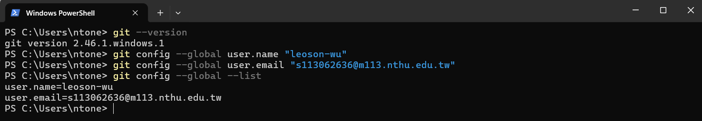
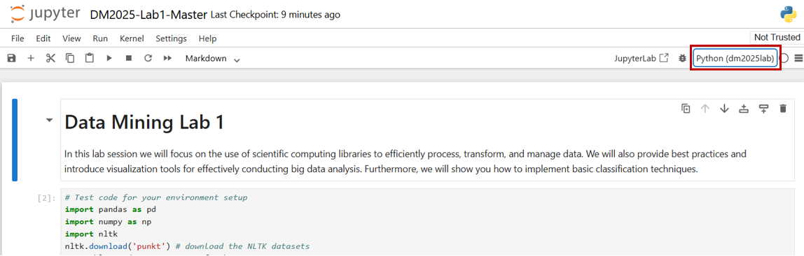

# [DM2025] Lab 1 – Environment Setup

Hi everyone,

We will have our first lab session on **September 15 (Monday)** at **9:00 AM** via our **YouTube Stream / Classroom**. Please be on time.

We strongly recommend setting up the environment on your personal laptop before the lab session so that you can follow along smoothly.

This document provides detailed instructions for setting up the environment required for the course.

---

## System Requirements

Please make sure you have the following installed:

* Python 3.9.9
* uv (Python virtual environment manager)
* Git
* GitHub account
* Jupyter Notebook

---

## Setup Instructions

### 1. Install Python 3.9.9

Download and install Python 3.9.9:
https://www.python.org/downloads/release/python-399/

During installation, check "**Add Python to PATH**".

Verify installation:

```bash
python --version
```
Expected output:
Python 3.9.9  

### 2. Create a GitHub Account and Install Git
#### Sign up for GitHub: https://github.com/  
#### Install Git:  
##### Windows: https://gitforwindows.org/  
##### Linux:

```bash
sudo apt install git-all
```
##### macOS:


```bash
brew install git
```
#### Verify installation:

```bash
git --version
```
Configure Git (replace with your GitHub username and email):
```bash
git config --global user.name "YOUR_USERNAME"
git config --global user.email "your_email@example.com"
```



### 3. Fork the Repository to your GitHub Account  
Go to: [DM Lab 1](https://github.com/leoson-wu/DM2025-Lab1-Exercise.git) in Git,
Sign in to your GitHub account   
Click "Fork" to copy it into your own GitHub account.  


And it will redirect you to a "copy" of the repository in your own account. Once in your account (check that your name shows up at the top left corner), click the green button "Code", and the clipboard button beside the **link** that pops up. 


### 4. Create a Project Folder and Clone the Repository from your GitHub to your Project Directory   
Choose a location for your labs and create a directory:

Open a "Command Prompt" window in Windows or a "Terminal" window in macOS/Linux. Type the following commands, followed by the Enter key for each line: 

    cd <yourpath>
    mkdir DM2025Labs
    cd DM2025Labs
    git init
    git clone <link you copied at the previous step>
    
Replace \<yourpath\> by the path where you're going to store your documents. 
Below is an example, where I store my Lab in the "new" folder.


### 5. Install uv
In terminal or PowerShell:

```bash
pip install uv
uv --version
```
### 6. Create a Virtual Environment with uv
```bash
cd <your path to the DM2025-Lab1-Exercise>
uv venv
```

This creates a .venv folder inside the project.

### 7. Add the Dependent Libraries

```bash
uv sync
```
This installs all required Python packages.

### 8. (Optional) Manually install Libraries
You may need to add libraries manually if the **step 8** cannot install the required libraries successfully:  
```bash
uv add jupyter numpy pandas matplotlib plotly nltk scikit-learn seaborn pami umap-learn
```
You can also install extra libraries if needed.  
```bash
uv add <library_name>
```
### 8. (Alternative) If you are using Kaggle or Colab (if not, you can skip)   
Install the library with these commands 


### 9. Run Jupyter Notebook
Start Jupyter:

```bash
cd <your path to the DM2025-Lab1-Exercise>
jupyter notebook
```


If error occurs:

```bash
python -m notebook
```
A browser window will open. Click "New" → "Python 3" to create a notebook.  


### 10. Download NLTK Datasets
Run the following code in the code cell for downloading NLTK Datasets    
```Python
import nltk
nltk.download('punkt')
```

### 11. Test Your Environment
Paste the script below into a notebook cell and run it:

```Python
import pandas as pd
import numpy as np
import nltk
from sklearn.datasets import fetch_20newsgroups
from sklearn.feature_extraction.text import CountVectorizer
import plotly as py
import math
import PAMI
import umap

categories = ['alt.atheism', 'soc.religion.christian', 'comp.graphics', 'sci.med']
twenty_train = fetch_20newsgroups(subset='train', categories=categories, shuffle=True, random_state=42)
```


If no errors occur, your environment is ready.

### Alternative: Run in Kaggle
If you cannot set up Python locally:
Create an account: https://www.kaggle.com/
Go to: https://www.kaggle.com/kernels → "New Notebook"
Run the test script.
For missing libraries (e.g., PAMI), install manually:

```bash
!pip install pami
```


### Optional: Run in VS Code
If using VS Code, register your kernel:

```bash
uv run python -m ipykernel install --user --name=dm2025lab --display-name "Python (dm2025lab)"
```
Then select "Python (dm2025lab)" as the kernel.


### Troubleshooting
Ask classmates or TAs for help before the lab if you encounter installation issues.
If you prefer a GUI for Git, use GitHub Desktop: https://desktop.github.com/
Good luck with the setup and see you on Monday, Sept 15!

Best regards,
The TAs

---
# Now you can start to do the lab ...
---

# Save your Progress by Push 
Remember to save your notebooks. You will also have to "Push" the changes you've made in your computer to the internet. To do this, open a "Command Prompt" window in Windows or a "Terminal" window in macOS/Linux. Type the following commands followed by the Enter key: 

    cd <your path to the DM2025-Lab1-Exercise>
    git add *
    git commit -m "yourmessage"
    git push 
    
You can replace "yourmessage" with something like "Finished Ex1 and Ex2. Added graph for Ex. 6" . You can save and commit as often as you like. Below is an example:


# Hand in your Homework

Go to the [DM Lab 1 Homework](https://github.com/leoson-wu/DM2025-Lab1-Exercise/blob/main/DM2025-Lab1-Homework.ipynb) in Git and follow the same process above.  Make sure to commit and save your changes to your repository __BEFORE the deadline for each phase (September 28th and October 19th, 11:59 pm, Sunday)__. During the second phase, the answers from the first phase will not be considered if they can not be pushed on time. 

Make sure to hand in 2 notebooks, including: 
1. Take home exercises from [DM Lab 1](https://github.com/leoson-wu/DM2025-Lab1-Exercise/blob/main/DM2025-Lab1-Master.ipynb)
2. The homework itself [DM Lab 1 Homework](https://github.com/leoson-wu/DM2025-Lab1-Exercise/blob/main/DM2025-Lab1-Homework.ipynb)


When you're done (or at any moment), find your repository link. Open the **\[DM2025\] Homework 1** assignment page on our [NTU COOL platform](https://cool.ntu.edu.tw/login/portal) for each phase. Make a submission and paste the link to your git repository (or the link to your Kaggle kernel).  

You can find your repository link by logging into [Github](https://github.com/), clicking on your profile icon on the upper right corner, selecting "Your repositories", and clicking on the name of your repository. Then copy the link in your browser.  

Again, __we will not consider pushes made after the deadline__. 


That's it! We wish you Good luck!
