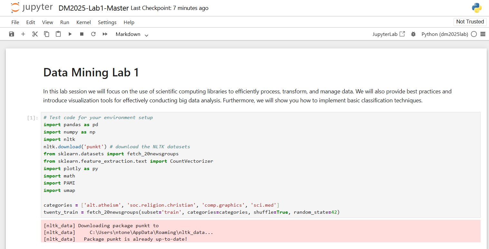

# [DM2025] Lab 1 – Environment Setup

Hi everyone,

We will have our first lab session (for Q&A) on **September 15 (Monday)** at **9:00 AM** via our [YouTube Stream](https://www.youtube.com/@NTHU_ISA5810_DataMining)/**Classroom**. Please be on time.

The Lab tutorial video will be launched on [YouTube Channel](https://www.youtube.com/@NTHU_ISA5810_DataMining) before **September 15**.

We strongly recommend setting up the environment on your personal laptop before the lab session so that you can follow along smoothly.

This document provides detailed instructions for setting up the environment required for the course.

---

## System Requirements

Please make sure you have the following installed:

* Python 3.11.0 (recommended)
* uv (Python virtual environment manager)
* Git
* GitHub account
* Jupyter Notebook

---

## Setup Instructions

### 1. Install Python 3.11.0 (If you use your own version, take your own risk of dependency issues)

Download and install Python 3.11.0 (recommended):
https://www.python.org/downloads/release/python-3110/

During installation, check "**Add Python to PATH**".

Verify installation:

```bash
python --version
```
Expected output:
Python 3.11.0  

### 2. Create a GitHub Account and Install Git
#### Sign up for GitHub: https://github.com/  
#### Install Git:  
##### Windows: https://gitforwindows.org/  
##### Linux:

```bash
sudo apt install git-all
```
##### macOS:


```bash
brew install git
```
#### Verify installation:

```bash
git --version
```
Configure Git (replace with your GitHub username and email):
```bash
git config --global user.name "YOUR_USERNAME"
git config --global user.email "your_email@example.com"
```


### 3. Fork the Repository to your GitHub Account  
Go to: [DM Lab 1](https://github.com/leoson-wu/DM2025-Lab1-Exercise.git) in GitHub,  
Sign in to your GitHub account  
Click "Fork" to copy it into your own GitHub account.  


And it will redirect you to a "copy" of the repository in your own account. Once in your account (check that your name shows up at the top left corner), click the green button "Code", and the clipboard button beside the **link** that pops up. 


### 4. Create a Project Folder and Clone the Repository from your GitHub to your Project Directory   
Choose a location for your labs and create a directory:

Open a "Command Prompt" window in Windows or a "Terminal" window in macOS/Linux. Type the following commands, followed by the Enter key for each line: 

    cd <yourpath>
    mkdir DM2025Labs
    cd DM2025Labs
    git clone <link you copied in the previous step>
    
Replace \<yourpath\> by the path where you're going to store your documents. 
Below is an example, where I store my Lab in the "new" folder.


### 5. Install uv
In terminal or PowerShell:

```bash
pip3 install uv
uv --version
```
### 6. Create a Virtual Environment with uv
Navigate to the project folder: `DM2025-Lab1-Exercise` and create Virtual Environment  
The Virtual Environment must be created under the project folder: `DM2025-Lab1-Exercise`  
```bash
cd <your path to the DM2025-Lab1-Exercise>
uv venv
```

This creates a .venv folder inside the project.

### 7. Install the Dependent Libraries

Under project folder:  `DM2025-Lab1-Exercise`  
#### Install Libraries
```bash
uv add jupyter numpy pandas matplotlib plotly nltk scikit-learn seaborn pami umap-learn
```
This installs all required Python packages: jupyter, numpy, pandas, matplotlib, plotly, nltk, scikit-learn, seaborn, pami, umap-learn   
You can also install extra libraries if needed.  
```bash
uv add <library_name>
```
#### (Alternative) If you are using Kaggle or Colab   
Install the library via `pip3` instead of `uv`  
```bash
pip3 install jupyter numpy pandas matplotlib plotly nltk scikit-learn seaborn pami umap-learn  
```
Note: In Kaggle/Colab, Python version may differ (e.g., 3.10). Some packages could behave differently.

### 8. Register Jupyter Kernel
Under project folder:  `DM2025-Lab1-Exercise`  
```bash
uv activate venv
uv run python -m ipykernel install --user --name=dm2025lab --display-name "Python (dm2025lab)"
```
### 9. Run Notebook  
#### Run in VS Code
If using VS Code:

Open your terminal/PowerShell  
```bash
cd <your path to the DM2025-Lab1-Exercise>
code
```
Open the `DM2025-Lab1-Master.ipynb`  

Then select "Python (dm2025lab)" as the kernel in the top-right corner.  
  


#### (Alternative) Run Jupyter Notebook in Browser  
Start Jupyter:

```bash
cd <your path to the DM2025-Lab1-Exercise>
uv run jupyter notebook
```


If error occurs:

```bash
python -m notebook
```  
A browser window will open.  
Open the `DM2025-Lab1-Master.ipynb` 

Select **Python (dm2025lab)** as the notebook kernel on the top-right corner.  


#### (Alternative) Run in Kaggle
If you cannot set up Python locally:  
Create an account: https://www.kaggle.com/  
Go to: https://www.kaggle.com/kernels → "New Notebook"  
Run the test script.  
For missing libraries (e.g., PAMI), install manually:  

```bash
!pip3 install pami
```


### 10. Test Your Environment
Open the `DM2025-Lab1-Master.ipynb`

Paste the script below into a notebook cell and run it:

```python
# test code for environment setup
import pandas as pd
import numpy as np
import nltk
nltk.download('punkt') # download the NLTK datasets
from sklearn.datasets import fetch_20newsgroups
from sklearn.feature_extraction.text import CountVectorizer
import plotly as py
import math
# If you get "ModuleNotFoundError: No module named 'PAMI'"
# run the following in a new Jupyter cell:
# !pip3 install PAMI
import PAMI
import umap

categories = ['alt.atheism', 'soc.religion.christian', 'comp.graphics', 'sci.med']
twenty_train = fetch_20newsgroups(subset='train', categories=categories, shuffle=True, random_state=42)
```



If no errors occur, your environment is ready.


### Troubleshooting
Ask classmates or TAs for help before the lab if you encounter installation issues.  
If you prefer a GUI for Git, use GitHub Desktop: https://desktop.github.com/  
Good luck with the setup and see you on Monday, Sept 15!  

Best regards,
The TAs


